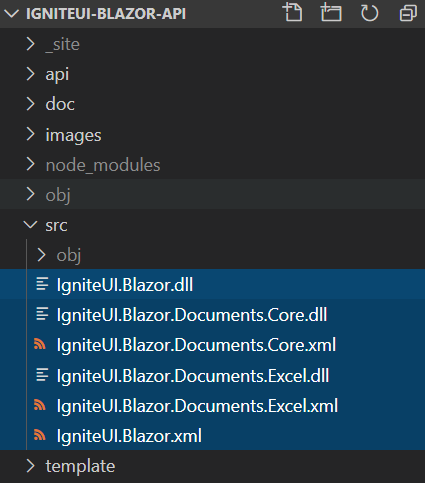

#  Ignite UI for Blazor API

This project generates API documentation for **Ignite UI for Blazor** components.

## Setup Instructions

- run `npm install` command

- copy `.dll` and `.xml` files from from latest [Blazor Packages](http://proget.infragistics.local:81/packages?Count=500&FeedId=13), e.g:

    - [IgniteUI.Blazor 21.2](http://proget.infragistics.local:81/feeds/IgniteUINuGet/IgniteUI.Blazor/21.2.818-dev)
    - [IgniteUI.Blazor.Documents.Excel 21.2](http://proget.infragistics.local:81/feeds/IgniteUINuGet/IgniteUI.Blazor.Documents.Excel/21.2.818-dev)
    - [IgniteUI.Blazor.Documents.Core 21.2](http://proget.infragistics.local:81/feeds/IgniteUINuGet/IgniteUI.Blazor.Documents.Core/21.2.818-dev)

- paste copied `.dll` and `.xml` files in `src` folder:

## Build Instructions

- run `gulp build` command to generate output files in the `_site` folder

- copy content of the `_site` folder to hosting server